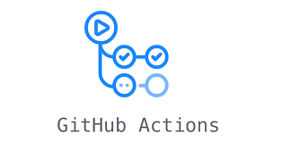

- ### Hi there, I'm AmirHossein Darbandsary👋

  ## I'm a   Data Scientist, AI Researcher And the important Part : Developer 
  **My Linkedin Page** : 
 

  * 🔭 I am Currently working as **Ai Ml Researcher&Developer** 

  - 🌱 I’m currently Learning  All the things related to my **Major** 😎.

  
  - 🥅 2023 Goals: Explore the more and more research in my majors AND to be a better developer;   

  - ⚡ Fun fact: I love to *CODE*.
  ---
  
  []  []
    
  
  ---
 

  
    ## ⚡  Technologies I use 
   
     
    

        <table align="center" bordercolor="green" border=3>
            <tr bordercolor="red" border=2 >
                <td align="center" width="140" height="112.43">
                    
                      Python
                </td>
                <td align="center" width="140" height="112.43">
                    
                      Jupyter
                </td>
                <td align="center" width="140" height="112.43">
                    
                      TensorFlow
                </td>
                <td align="center" width="140" height="112.43">
                    
                      Pytorch
                </td>  
            </tr>
           <tr bordercolor="blue" border=2>
               <td align="center" width="140" height="112.43">
                    
                      FastAPI
                </td>
                <td align="center" width="140" height="112.43">
                    
                      Docker
                </td>
                <td align="center" width="140" height="112.43">
                    
                      aws
                </td>
                 <td align="center" width="140" height="112.43">
                    
                      GitHub action
                </td>
           </tr>
        </table>
    

     
    

---

***Thanks for visiting my profile.***
