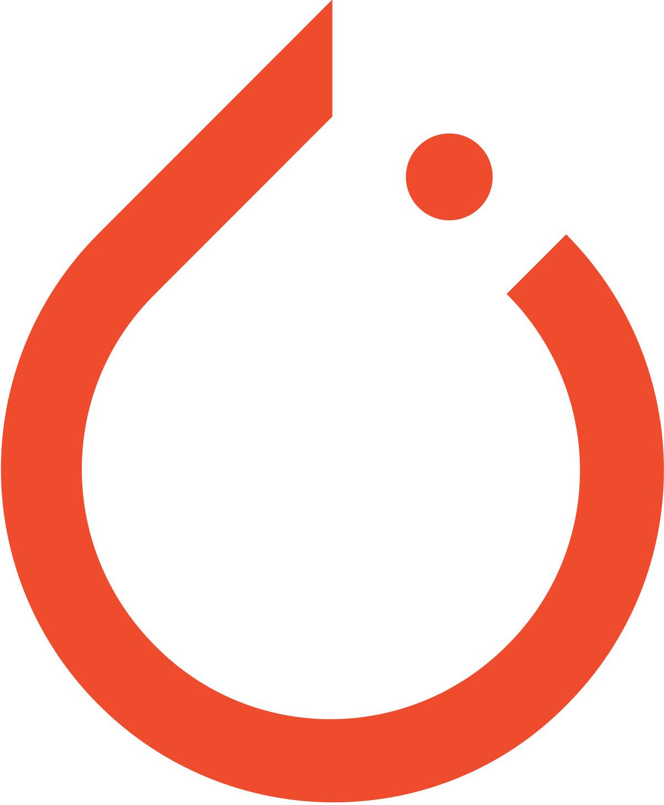

- ### Hi there, I'm AmirHossein Darbandsary👋

  ## I'm a Translator ,  Data Scientist, AI Researcher,  
 

  * 🔭 I am Currently working as ** Computer vision developer ** 

  - 🌱 I’m currently Learning Data Analytics 😎.

  
  - 🥅 2022 Goals: Explore the more and more research of Computer vision, Deep learning, Time Series Analysis , Data Analytics and Be a good trader.

  - ⚡ Fun fact: I love to code.
  
    
    
   
    ## ⚡  Technologies I use 
    
     
    
    

        <table align="center">
            <tr>
                <td align="center" width="140" height="112.43">
                    
                      Python
                </td>
                <td align="center" width="140" height="112.43">
                    
                      Jupyter
                </td>
                <td align="center" width="140" height="112.43">
                    
                      TensorFlow
                </td>
                <td align="center" width="140" height="112.43">
                    
                      Pytorch
                </td>
                <td align="center" width="140" height="112.43">
                    
                      FastAPI
                </td>
                <td align="center" width="140" height="112.43">
                    
                      Docker
                </td>
            </tr>
        </table>
    

     

---

---

***Thanks for visit my profile.***
